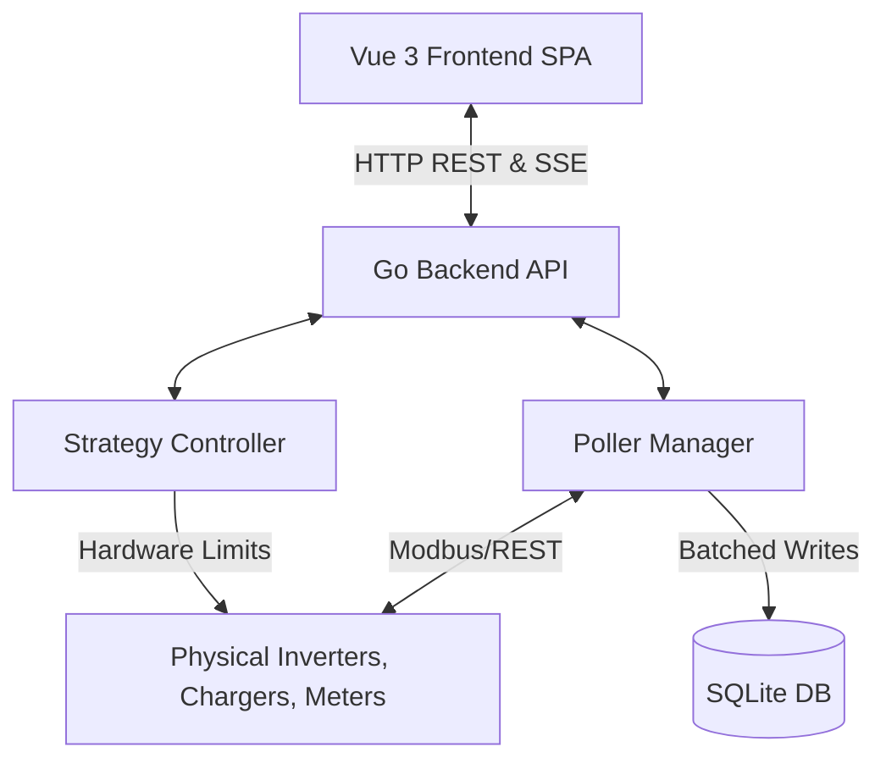

# Architecture Overview

NEMS (Pulse EMS) is designed as a lightweight, embedded Energy Management System (EMS) optimized for running on low-powered ARM hardware (like a Raspberry Pi) without wearing out the SD card.

## High-Level Architecture

The system follows a monolith architecture composed of two main parts:
1. **Go Backend:** A statically compiled binary that serves both the JSON API, handles hardware device polling (Modbus/REST), executes energy control strategies, and serves the static frontend assets.
2. **Vue 3 Frontend:** A Single Page Application (SPA) that provides a fully UI-driven interface for monitoring and configuring the EMS.

## Data Flow

### 1. Device Polling (`PollerManager`)
- The `PollerManager` instantiates "Pollers" based on configured device templates (e.g., Huawei Modbus, Raedian REST).
- It runs two tickers:
  - **Fast Ticker (1s):** Polls high-frequency devices (like smart meters) to ensure rapid reaction times for zero-export logic.
  - **Standard Ticker (5s):** Polls heavier devices (like inverters and EV chargers).
- Polled data is immediately cached in memory (`deviceCache`) to decouple hardware IO from UI responsiveness.

### 2. Live Site State (SSE)
- When new data is polled, the `PollerManager` aggregates the data (total grid, total solar, etc.) into a `SiteState` struct.
- This struct is broadcasted to the frontend via Server-Sent Events (SSE) at the `/api/live` endpoint. This allows the Vue dashboard to update in real-time without continuous AJAX polling.

### 3. Historical Data & Database
- To minimize SD card wear, the `PollerManager` buffers polled measurements in memory.
- Every 1 minute, the `flushBuffer` function runs, averages the buffered data, and performs a single transactional `INSERT` into the SQLite `measurements` table.
- SQLite is configured with WAL mode (`journal_mode=WAL`), `synchronous=NORMAL`, and `temp_store=MEMORY` to further reduce disk I/O.

### 4. Strategy Execution
- The `StrategyController` runs a background loop (every 2-10 seconds depending on load).
- It reads the latest `deviceCache` from the `PollerManager`.
- Based on the user's selected strategy (Eco, Flanders, Netherlands), it calculates optimal setpoints.
- It then dispatches commands (e.g., `SetActivePowerLimit` for inverters or `SetChargeCurrent` for EV chargers) to the physical devices to enforce the strategy.

## Design Decisions

- **No YAML:** Unlike EVCC or Home Assistant, NEMS strictly uses a UI-driven database approach. Device configurations are stored in SQLite. This lowers the barrier to entry for non-technical users.
- **Null Safety in JSON:** The `SiteState` struct uses pointers for float values (`*float64`). If a device type (e.g., a Battery) is not configured, the pointer remains `nil`, resulting in `null` in the JSON payload. The Vue frontend uses this `null` state to completely hide the relevant UI cards, rather than displaying `0 W`.
- **Registry Pattern for Devices:** Device templates are added by creating a new file in `backend/internal/templates/` and calling `registry.RegisterTemplate()` inside the `init()` function. This makes adding new hardware integrations highly modular.
