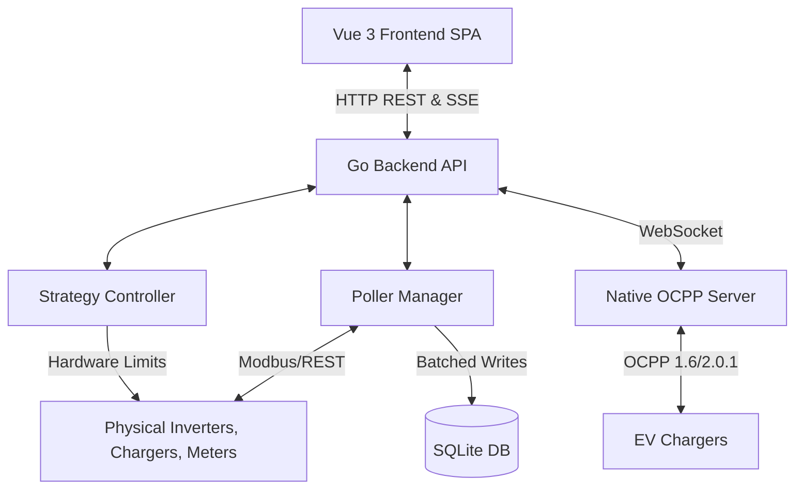

# Architecture Overview

NEMS (Pulse EMS) is designed as a lightweight, embedded Energy Management System (EMS) optimized for running on low-powered ARM hardware (like a Raspberry Pi) without wearing out the SD card.

## High-Level Architecture

The system follows a monolith architecture composed of two main parts:
1. **Go Backend:** A statically compiled binary that serves both the JSON API, handles hardware device polling (Modbus/REST), executes energy control strategies, and serves the static frontend assets. The build number is injected as a release tag at compile time via `-ldflags="-X main.BuildNumber=${GITHUB_REF_NAME}"`, and CPU data is explicitly omitted from system info endpoints.
2. **Vue 3 Frontend:** A Single Page Application (SPA) that provides a fully UI-driven interface for monitoring and configuring the EMS.

Both parts are combined during the CI/CD release process into a single Debian (`.deb`) package, encapsulating the frontend assets and the backend binary. This package sets up the restricted `nems` system user and manages the `nems.service` systemd unit. For seamless onboarding, the project also generates a custom Raspberry Pi OS Lite image that pre-installs the `.deb` package, `nginx` as a reverse proxy, a minimal Wayland desktop (`wayfire`), and `rpi-connect` to enable out-of-the-box remote screen sharing (host set to `ems`).

## Data Flow

### 1. Device Polling (`PollerManager`)
- The `PollerManager` instantiates "Pollers" based on configured device templates (e.g., Huawei Modbus, Raedian REST).
- It runs two tickers:
  - **Fast Ticker (1s):** Polls high-frequency devices (like smart meters) to ensure rapid reaction times for zero-export logic.
  - **Standard Ticker (5s):** Polls heavier devices (like inverters and EV chargers).
- Polled data is immediately cached in memory (`deviceCache`) to decouple hardware IO from UI responsiveness.

### 2. Native OCPP Server
- A built-in WebSocket server at `/api/ocpp/` handles incoming connections from EV Chargers.
- The `OcppState` struct receives live telemetry (e.g., `MeterValues`, `Heartbeat`, `BootNotification`) directly from the charger.

### 3. Live Site State (SSE)
- When new data is polled, the `PollerManager` aggregates the data (total grid, total solar, etc.) into a `SiteState` struct.
- This struct is broadcasted to the frontend via Server-Sent Events (SSE) at the `/api/live` endpoint. This allows the Vue dashboard to update in real-time without continuous AJAX polling.

### 4. Historical Data & Database
- To minimize SD card wear, the `PollerManager` buffers polled measurements in memory.
- Every 1 minute, the `flushBuffer` function runs, averages the buffered data, and performs a single transactional `INSERT` into the SQLite `measurements` table.
- SQLite is configured with WAL mode (`journal_mode=WAL`), `synchronous=NORMAL`, and `temp_store=MEMORY` to further reduce disk I/O.

### 5. Strategy Execution
- The `StrategyController` runs a background loop (every 2 seconds).
- It reads the latest `deviceCache` from the `PollerManager` and categorizes the measurements using the `registry.GetCategory()` properties to aggregate composite values (`totalGridImport`, `totalSolar`).
- Based on the user's selected strategy (Eco, Flanders, Netherlands), it calculates optimal setpoints:
  - **Predictive Peak Shaving:** In Flanders mode, an instantaneous power allowance is dynamically calculated based on the elapsed time in the synchronized 15-minute window and the currently accumulated `avg15MinImport` energy. The EV chargers and batteries are sequentially throttled based on priority against this dynamic limit.
  - **Dynamic Battery Arbitrage:** The EMS optimizes battery operation via Day-Ahead EPEX spot prices using dynamic price spreads.
- It then safely dispatches hardware commands, immediately checking for execution errors (`err == nil`) before reflecting state updates within the internal EMS `strategyMaps`.

## Design Decisions

- **Scope Directives:** Car integration, billing, RFID, and ENTSO-E/imbalance APIs are strictly forbidden.
- **Network Scanner Heuristics:** To achieve zero-dependency network discovery across multiple manufacturer hardware types, NEMS implements localized mapping of MAC Organizationally Unique Identifiers (OUIs). This avoids runtime third-party API dependencies and ensures rapid scanning performance.
- **No YAML:** NEMS strictly uses a UI-driven database approach. Device configurations are stored in SQLite. This lowers the barrier to entry for non-technical users.
- **Null Safety in JSON:** The `SiteState` struct uses pointers for float values (`*float64`). If a device type (e.g., a Battery) is not configured, the pointer remains `nil`, resulting in `null` in the JSON payload. The Vue frontend uses this `null` state to completely hide the relevant UI cards, rather than displaying `0 W`.
- **Registry Pattern for Devices:** Device templates are added by creating a new file in `backend/internal/templates/` and calling `registry.RegisterTemplate()` inside the `init()` function. This makes adding new hardware integrations highly modular.
